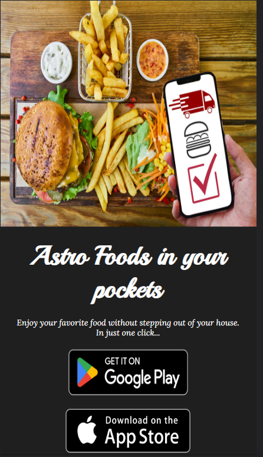

# ASTRO-FOODS
HTML-5 CSS-3

### Links

## Table of contents
- [Overview](#overview)
- [Screenshot](#screenshot)
- [Links](#links)
- [Built with](#built-with)
- [Useful resources](#useful-resources)
- [Author](#author)

## Overview
Welcome to my "Astro Foods" – an out-of-this-world frontend responsive website designed using HTML5 and CSS3. My website's captivating layout and celestial theme create an immersive dining experience for visitors. With seamless responsiveness across all devices, customers can easily explore, packed with cosmic flavors and delectable dishes. Embracing modern design principles, my website showcases mouthwatering food imagery, enticing guests to explore. From heavenly desserts to savory delights, Astro Foods' website promises an astronomical culinary adventure for all food enthusiasts.

### Screenshot

### Built with
- HTML5 markup
- CSS custom properties
- Flex-box

### Useful resources
- W3schools (https://www.w3schools.com/)

## Author
Priya
- GitHub: (https://github.com/Priya-git21)
- LinkedIn: (https://www.linkedin.com/in/priya-makkar-851973223/)